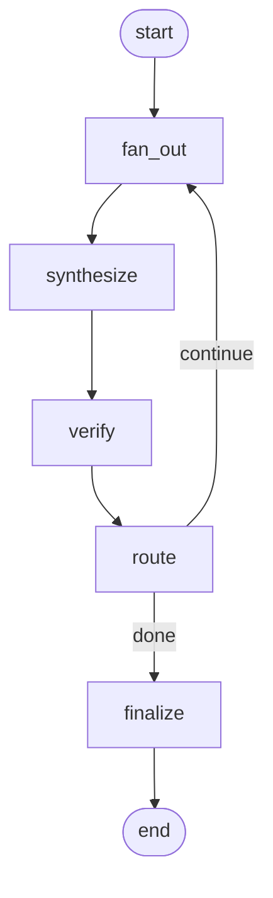

# Multi-LLM equity analyst

Python CLI that renders a Jinja2 equity/options prompt from YAML config, fans out to multiple LLM providers in parallel, and synthesizes a consensus report. Optional **iterative** mode runs a LangGraph loop: multi-provider fan-out, synthesis with per-round confidence parsing, web-grounded verification, routing, and final packaging with SQLite checkpointing for resume.

## Install

```bash
python -m venv .venv
source .venv/bin/activate
pip install -r requirements.txt
```

## API keys

Copy `.env.example` to `.env` and set keys for the providers you enable in config:

- `ANTHROPIC_API_KEY`
- `OPENAI_API_KEY`
- `GEMINI_API_KEY`
- `XAI_API_KEY` (Grok)

## Standard mode

```bash
python -m equity_analyst run --config configs/mndy_2026_05_08.yaml
```

Dry-run (no API calls; writes preview under `outputs/`):

```bash
python -m equity_analyst run --config configs/mndy_2026_05_08.yaml --dry-run
```

### Web search and performance

Provider web search tools are **on by default** and are often the dominant source of latency. For faster runs, disable them:

```bash
python -m equity_analyst run --config configs/mndy_2026_05_08.yaml --no-web-search
```

The same flag works in iterative mode. Legacy aliases **`--enable-web-search` / `--no-enable-web-search`** still map to the same setting as `--web-search` / `--no-web-search`.

YAML may set **per-provider** overrides (`web_search: true|false`) and optional **per-provider timeouts** (`request_timeout_s`). Global defaults: `request_timeout_s` (default **180** seconds), `max_output_tokens` (default **4096**), and `verifier_max_output_tokens` (default **1536**, iterative verifier only).

```yaml
request_timeout_s: 180
max_output_tokens: 4096
verifier_max_output_tokens: 1536
providers:
  - name: anthropic
    web_search: true
  - name: openai
    web_search: false
  - name: gemini
    request_timeout_s: 120
```

The simple list form remains valid: `providers: ["anthropic", "openai"]`.

### Run timing (`run.json`)

After a **live** standard run, `run.json` includes a **`timing`** object: `parallel_provider_batch_wall_s`, `synthesis_wall_s`, `total_wall_s`, and `per_provider` latency snapshots. Iterative runs add a **`timing`** summary when `finalize` runs (per-iteration provider, synthesis, and verify wall times plus `total_sequential_wall_s`). INFO logs also emit a heartbeat every **30s** while waiting on a provider batch.

## Iterative mode

Iterative runs use a LangGraph `StateGraph` with nodes `fan_out` → `synthesize` → `verify` → `route` → (`fan_out` again or `finalize`). Each round:

1. **fan_out** – all configured providers answer the prompt plus any accumulated follow-up questions.
2. **synthesize** – the synthesizer must emit section confidences and a line `OVERALL_CONFIDENCE: <0.0-1.0>` for routing.
3. **verify** – default Anthropic-backed verifier returns JSON `verified` / `contradicted` / `unverifiable` using web search when enabled.
4. **route** – finalize if `len(rounds) >= max_iterations`, or if overall confidence meets `--confidence-threshold` and there are no contradictions; otherwise append follow-ups and loop.
5. **finalize** – writes `synthesis.md`, per-round files under `iterations/`, and `checkpoint.sqlite`.

```bash
python -m equity_analyst run --config configs/mndy_2026_05_08.yaml --iterative \
  --max-iterations 3 --confidence-threshold 0.85
```

Iterative dry-run (compiles the graph and prints an excerpt of the rendered prompt):

```bash
python -m equity_analyst run --config configs/mndy_2026_05_08.yaml --iterative --dry-run
```

## Resume after a crash

Iterative runs store checkpoints at `outputs/<run_id>/checkpoint.sqlite` and metadata in `run.json`. Resume with the output folder name (e.g. `MNDY_20260509T120000Z`):

```bash
python -m equity_analyst run --iterative --resume MNDY_20260509T120000Z
```

If `run.json` is present, `--config` can be omitted; you may still pass `--config` to override.

## Graph (iterative)



## Logging

Progress logs use the stdlib `logging` package on the `equity_analyst` logger. By default the CLI prints **INFO** lines to **stderr** with timestamp, level, logger name, and message.

- Set verbosity with `--log-level DEBUG|INFO|WARNING|ERROR` on `run` (default `INFO`).
- **DEBUG** adds request-shape hints from providers (model name, character counts, tool flags) without logging API keys, full bodies, or `.env` contents.

When the CLI writes a run under `outputs/<symbol>_<timestamp>/` (standard mode, iterative mode, or standard **dry-run**), it also appends the same log lines to **`outputs/<...>/agent.log`**.

**Iterative `--dry-run`** does not create an output directory, so no `agent.log` is produced for that path; use stderr only or run without `--dry-run` to capture a file.

## Development checks

```bash
ruff check .
mypy --strict equity_analyst
pytest -q
```
