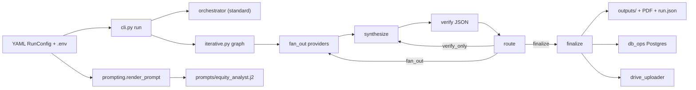

# Product and system requirements

Living document for **multi-LLM equity analysis** around earnings events. It captures what the system does today, **why** the main rules exist, where they are enforced in code or templates, and which **knobs** operators tune without rereading git history.

---

## 1. Product overview

### Purpose

Run **parallel multi-provider** equity/options research for a single symbol ahead of or around an **earnings** cycle, then **synthesize** a consensus narrative, optionally **verify** claims in a refinement loop, and persist artifacts for **calibration**, **reporting**, and **Drive** sharing.

### Inputs

| Input | Role |
| --- | --- |
| **Ticker** (`symbol`) | Primary subject; drives prompts, yfinance, and output paths. |
| **Earnings date / session labels** (`earnings_date`, `today_date`, `today_session`) | Anchor timing and template “Date anchors”. |
| **Target dates** (`target_dates`, `next_trading_day`, `followup_open_date`) | Map prediction horizons to concrete sessions. |
| **Optional YAML price hints** (`today_low` / `today_high` / `current_price` and aliases) | **Unverified** orientation only; prompt requires fresh **web_search** closes. |
| **Optional `earnings_timing`** | When set, printed as the brief’s schedule; when **omitted**, models must **verify** BMO/AMC/during-hours via web (see §3). |
| **Same-day intraday bounds** (`same_day_intraday_min` / `max`, or auto-fetch) | Enables same-day σ-band anchoring branch (see §3). |
| **Options chain** (`options_chain_auto_fetch`, `options_chain_snapshot`) | Injects **Verified options chain** table when available (see §3, §9). |

### Outputs (per run)

| Artifact | Typical path / notes |
| --- | --- |
| Per-provider markdown | `outputs/<RUN>/claude.md`, `openai.md`, `grok.md`, `gemini.md` |
| LLM prompt exports | `outputs/<RUN>/prompts/` (`*.md` per call, optional `*.context.json` for fan-out Jinja context, `prompts_index.md` summary); omit by setting **`EXPORT_PROMPTS=0`** |
| Synthesized analysis | `outputs/<RUN>/synthesis.md` (+ optional `.pdf` sibling) |
| Verified JSON (iterative) | Embedded in round state; verifier output parsed in `iterative.py` |
| Facts packet | `outputs/<RUN>/facts_packet.md` when facts extraction runs |
| Prediction extracts | Postgres `predictions` and/or `predictions_extract.json` fallback |
| PDF report | `pdf_writer.py` — WeasyPrint siblings next to key `.md` files |
| Postgres rows | `runs`, `provider_responses`, optional `outcomes`, `predictions` (`db_models.py`) |
| Drive mirror | Optional upload of run tree under configured root (`drive_uploader.py`) |

### Iterative loop (summary)

Graph nodes in `equity_analyst/iterative.py`: **`fan_out` → `synthesize` → `verify` → `route`**, then either:

- **`fan_out`** again (contradictions, high unverifiable + low confidence, mixed/low-confidence path, `force_fan_out_on_continue`, or verifier/router-driven refan),
- **implicit “verify_only” path**: `route` sends **`goto synthesize`** with citation follow-ups while **skipping** provider fan-out when `unverifiable_only_skip_fan_out` applies (see §4),
- **`finalize`**: confidence threshold met with clean verification, or **iteration budget** exhausted.

---

## 2. Architecture

### Module map (`equity_analyst/`)

| Module | Responsibility |
| --- | --- |
| `cli.py` | Argparse entrypoints: `run`, outcome tools, db-backfill, prediction extract, Drive OAuth setup wiring. |
| `config.py` | `RunConfig` (Pydantic): YAML + env coalescing, provider list, iterative flags, token budgets. |
| `orchestrator.py` | **Standard** (non-iterative) path: render prompt, parallel providers, synthesize, `run.json`, optional DB/Drive/PDF. |
| `iterative.py` | LangGraph refinement: fan-out, synthesis, verify JSON, routing, finalize, checkpointing, sigma/chain audits. |
| `prompting.py` | Jinja render for `prompts/equity_analyst.j2`; resolves same-day intraday and options chain context. |
| `prompt_parts.py` | Loads static system markdown for equity + caching split. |
| `provider_runtime.py` | Web-search defaults per provider, timeouts, fan-out token caps, failure partitioning. |
| `providers/*` | Anthropic, OpenAI, Gemini, Grok adapters (`base.py`, `registry.py`). |
| `synthesizer.py` | Merges provider bodies into consensus markdown; oversized-body path hooks. |
| `provider_summarize.py` | Gemini Flash summarization of huge provider texts before synthesis. |
| `facts_packet.py` | Round-1 **frozen facts** markdown for later iterations. |
| `prediction_extract.py` | Horizon structured JSON → Postgres / fallback file. |
| `outcome_tracker.py` | yfinance OHLC for labeling runs; intraday high/low helper for same-day anchoring. |
| `options_chain.py` | Yahoo chain snapshot → markdown table; **expiry audit** strings; **weekly vs standard monthly** front-expiry resolution for event straddle / sigma anchoring (`is_standard_monthly_expiration`, `pick_front_listed_expiry_for_earnings`). |
| `pdf_writer.py` | Markdown → HTML → PDF (WeasyPrint). |
| `db_models.py` / `db_ops.py` | SQLAlchemy schema and best-effort upserts. |
| `drive_uploader.py` | Service account or OAuth upload to Shared Drive / user folder. |

### Data flow



Standard runs skip the inner loop: **CLI → Orchestrator → providers + synthesizer → artifacts**.

### Provider roles

| Role | Typical config | Notes |
| --- | --- | --- |
| **Analyst providers** (fan-out) | `providers: [anthropic, openai, grok, gemini]` | Parallel; each writes its own `.md`. |
| **Synthesizer** | `synthesizer:` (often Gemini Pro) | Single cross-provider weave; must emit `OVERALL_CONFIDENCE:` for routing. |
| **Verifier** | `verifier_provider` / `verifier_model` | JSON-only verification + optional sigma-band audit keys. |
| **Oversized summarizer** | `oversized_summarize_*` | Compresses huge provider bodies before synthesis (`provider_summarize.py`). |

Production YAML typically sets **`web_search: true`** on fan-out, synthesizer, and verifier where the registry supports it, so earnings timing, news, and fact checks are grounded.

### Postgres schema (overview)

Authoritative ORM definitions: **`equity_analyst/db_models.py`**.

- **`runs`**: `run_id`, `symbol`, `earnings_date`, iterative flags, `config_snapshot` JSONB, synthesis path, synthesizer metadata, verifier summary JSON, Drive URL, timestamps.
- **`provider_responses`**: per-provider rows with model, latency, token usage, `response_path`, iteration index.
- **`outcomes`**: realized OHLC windows and `direction_vs_prior_close` for calibration (linked by `run_id`).
- **`predictions`**: five horizons with probability/ranges/point estimates (`prediction_extract.py`).

### Drive and PDF paths

- **PDF**: `pdf_writer.maybe_write_pdf_sibling` writes next to the Markdown target when `pdf_output_enabled` is true and WeasyPrint imports succeed; failures are logged, not fatal.
- **Drive**: After run completion, `drive_uploader` may upload the entire output directory (excluding checkpoint sqlite artifacts), nesting under `prod/` or `test/` per `run_environment`. Requires Shared Drive (service account) or OAuth user setup per `README.md`.

---

## 3. Prompt conventions (rules the LLM must follow)

Each rule: **why**, **one-line summary**, **enforcement pointer**.

### Earnings-timing verification

- **Why:** YAML is often prepared before the IR calendar is final; wrong BMO/AMC breaks section 1/9/11 timing.
- **Summary:** If `earnings_timing` is absent, **web_search** the official schedule and cite URL + timestamp.
- **Pointer:** `prompts/equity_analyst.j2` (`` branch under earnings timing); `RunConfig.earnings_timing` in `config.py`.

### Same-day intraday anchoring

- **Why:** Post-open / post-print runs should anchor σ **dollar** bands to the **observed** regular-session range, not yesterday’s close.
- **Summary:** When `same_day_intraday_available=True`, anchor bands on **`[intraday_min − 1.00, intraday_max + 1.00]`** (one **price unit** per side, e.g. USD ±$1); else **prior regular-session close** (fetched and cited).
- **Pointer:** `prompts/equity_analyst.j2` (SD / range anchoring block); population of `same_day_intraday_*` in `equity_analyst/prompting.py` via `_resolve_same_day_intraday` (optional yfinance in `outcome_tracker.py` when `same_day_intraday_auto_fetch`).

### Pure-quant rule

- **Why:** Stops narrative sentiment from silently inflating/deflating **implied** levels or **σ widths**, which would break verifier and calibration.
- **Summary:** Option pricing, IV math, and **σ band widths** use **quant inputs only**; qualitative views affect **direction**, **scenario weights**, and **where** price sits inside bands—not widths or premiums.
- **Pointer:** `prompts/equity_analyst.j2` (**Pure-quant rule** blocks); cross-referenced in sections 8–12.

### σ band sanity rules

- **Why:** Prevents hallucinated same-day implied moves and inconsistent multi-horizon scaling; post-event horizons should treat the earnings jump and diffusion as **variance-additive**, not ad hoc two-baseline **√t** mixing.
- **Summary:** No fake 0-DTE implied move without a real expiry. **Canonical (horizon crosses the print, target on/after the earnings calendar session):** `σ(n) = √(event_jump² + n·daily_vol²)` with named `event_jump` / `daily_vol` sources, where **`n=0` on the earnings calendar session** is the raw jump only (no `daily_vol` term) and **`n` counts NYSE weekdays strictly after that calendar date through the target row**. **Cumulative variance** across two rows: `σ²(n₂) − σ²(n₁) = (n₂ − n₁)·daily_vol²` within ±25%. **Fallback (no event in the horizon):** **√t** scaling within one IV baseline from a named expiry, or **HV30 × √t**. Mandatory sanity line: variance form when using the decomposition, legacy **3σ(T+N)/3σ(T+1)** ratio form when using fallback only. Reject implausible tight 0-DTE bands vs known event vol.
- **Server pre-computed σ table (preferred path):** When the verified chain yields a front event-week **straddle / implied move** and **HV30** (or realized post-earnings daily vol as fallback) is available, `equity_analyst/sigma_compute.py::try_build_computed_sigma_bundle` builds a per-session table (`N`, half-widths %, dollar 1σ/2σ/3σ bounds, bounded-drift `prob_up_pct`) and `prompting.py` injects `computed_sigma_bands_markdown` / `computed_sigma_bands_available` / `computed_sigma_bands_table`. Equity and synthesizer prompts require **verbatim** use of that markdown when present so all providers see identical σ arithmetic. **Verifier:** when `computed_sigma_bands_table` is present in refinement state, `augment_verifier_result_with_sigma_structural_checks` runs **`verify_emitted_sigma_bands_match_computed`** on the synthesis `sigma_summary` JSON and flags **> 1 percentage point** drift on **1σ** or **3σ** half-widths vs the server row for that date (`unverifiable` router follow-ups). If the bundle is unavailable (missing chain or vol inputs), templates fall back to the legacy canonical-σ instructions and the verifier uses the variance-additive identity on emitted literals as before.
- **IV crush (HV30 × post/event IV):** When the verified chain lists both an **event-week** and **next weekly** expiry, `equity_analyst/options_chain.py::iv_crush_multiplier` may return a ratio in **[0.4, 1.2]**; `equity_analyst/prompting.py` injects `iv_crush_multiplier`, optional `hv30_annualized_pct` from Yahoo history (`fetch_hv30_annualized_percent`), and `daily_vol_iv_adjusted` = `(hv30_annualized_pct / √252) × iv_crush_multiplier` when both exist. Templates (`equity_analyst.j2`, `synthesizer_system.md`) tell providers/synthesizer to use the adjusted **daily_vol** for post-print diffusion when HV30 is the baseline. `iterative.py` may append an **unverifiable** “Cite or verify … after IV crush” line when `daily_vol=` in synthesis disagrees with that expectation by more than ±10%.
- **Pointer:** `prompts/equity_analyst.j2` and `prompts/synthesizer_system.md` (**σ band construction — sanity rules**); deterministic checks in `iterative.py` (`verify_variance_additive_sigma_band_sessions`, `verify_iv_crush_daily_vol_followups`, `augment_verifier_result_with_sigma_structural_checks`, and when a server table exists `sigma_compute.verify_emitted_sigma_bands_match_computed`); verifier brief in `VERIFIER_INSTRUCTION_PREFIX`. **Structured σ sessions:** providers must emit a **last** fenced ```json`` block with root key **`sigma_summary`** (see `equity_analyst/sigma_summary.py` / `parse_sigma_summary_json`); per-provider verification prefers that JSON over regex-parsed markdown.

#### `sigma_summary` JSON (per-provider verification)

- **Shape:** Root object `{"sigma_summary": { "anchor_price": number, "anchor_type": string, "sessions": [ ... ] } }` inside a fenced **`json`** code block. The parser uses the **last** such block in the provider text that contains `"sigma_summary"`.
- **Sessions:** Each element has `date` (**YYYY-MM-DD**), `label` (short string), optional integer `N` (ignored for math; recomputed from the earnings **calendar** date: **n=0** on that session row, then weekdays strictly after through each row), `one_sigma_half_width_pct` (strictly positive; **±% half-width** as shown on the 1σ line — % of anchor, **not** full width), and `three_sigma_half_width_pct` (same units). Optional **`prob_up_pct`** (0–100): when any session includes it, the root object must also include **`daily_drift_pct`**, **`drift_source`** (allowed enum), **`drift_source_value`**, and **`drift_citation`** so bounded-drift `Φ(μN/σ)` is auditable; otherwise parsing fails.
- **Verification:** With `event_jump=` and `daily_vol=` literals present, `per_provider_sigma_variance_check` recomputes weekday **`n`** from the earnings calendar date and runs the same variance-additive identity as markdown mode; when **`prob_up_pct`** is present, it also checks agreement with **`computed_prob_up_pct`** within **±2pp** per session. **Valid JSON wins** over regex-parsed 1σ/3σ lines when both are present. Missing or invalid JSON falls back to legacy markdown extraction; a **malformed** last `sigma_summary` block with no usable legacy rows yields `reason=missing_sigma_summary_json` (`passed=None`). **YAML:** `per_provider_sigma_variance_check: false` disables the per-provider check entirely (logged once per provider row as disabled).

**Per-round `severity` (router + synthesizer table):** After each fan-out round, `compute_severity_for_sigma_variance_results` assigns each provider row `severity` ∈ {`info`, `warning`, `error`, `na`}. Isolated single-provider variance failures (`passed=False` while applicable) are **`warning`**; **`error`** applies when the count of applicable `passed=False` rows **or** the count of `missing_literals` rows reaches **`sigma_variance_check_quorum_for_error`** (default **2**, range 1–10). Router fan-out follow-ups for σ literals / variance identity are emitted **only** for **`severity=error`** rows (set quorum to **1** to restore “any single miss escalates”). Env override: **`SIGMA_VARIANCE_CHECK_QUORUM_FOR_ERROR`** (YAML wins when the field is set in config).

### Horizon-aware qual:quant blend

- **Why:** Pre-open uncertainty differs from post-print tape-heavy sessions; the model must declare how it balances narrative vs market data.
- **Summary:** Horizon table: **55:45** (T−3 to T−1); **49:51** for **T+1 to T+5**; **T-0** rows use **`RunConfig.t0_blend_preset`** (`default` → 49:51, `quant_lean` → 40:60, `quant_dominant` → 1:99, `qual_dominant` → 99:1, always **qual : quant**). YAML `t0_blend_preset`, env **`EQUITY_T0_BLEND_PRESET`**, or CLI **`--t0-blend`** (CLI overrides). The digits are **trust-weighting and narrative-emphasis guidance only**—they **do not** authorize ad hoc numeric shifts to **`prob_up_pct`**, σ half-widths, or scenario-weight numbers (those follow Φ / cited quant math). On **directional disagreement**, default **qualitative** unless quant is **unambiguous and recent**.
- **Pointer:** `prompts/equity_analyst.j2` (section 8 fenced table + `t0_blend_literal`); `prompts/synthesizer_system.md` (`__T0_BLEND_LITERAL__` substitution in `synthesizer.py`); `equity_analyst/synthesizer_blend.py` (`horizon_blend_ratio_followups` preset-aware T-0 markdown rows; `qualitative_numeric_tilt_followups` bans `+5/+10`-style qualitative numeric edits in synthesis); sections 9, 11, 12 echo weighting rules.

### Qualitative overlay scope

- **Rule:** Qualitative research and the horizon blend shape **which scenarios to foreground**, **how to narrate disagreements** between story and tape, and **tie-breaks on directional bias** when quant is ambiguous. They **must not** move numbers: **`prob_up_pct`** is **only** from the bounded-drift **`Φ((daily_drift_pct × N) / one_sigma_half_width_pct)`** pipeline; **σ band widths** and **option-implied dollars** stay **pure-quant** (cited chain / vol / realized-move inputs).
- **Pointer:** `prompts/equity_analyst.j2` and `prompts/synthesizer_system.md` (**MUST — qualitative overlay does not move numbers**); `equity_analyst/synthesizer_blend.py` (`qualitative_numeric_tilt_followups`); verifier brief in `equity_analyst/iterative.py` (`VERIFIER_INSTRUCTION_PREFIX`).

### Verified options chain

- **Why:** Without a server-fetched chain, models invent expiries/strikes; that is hard for verifiers to falsify.
- **Summary:** `options_chain_auto_fetch` defaults to **true** (opt out with YAML `false` or `OPTIONS_CHAIN_AUTO_FETCH=0`). When enabled (or a valid `options_chain_snapshot` is set), the prompt injects a **Verified** markdown table—**use verbatim**; verifier/synthesis audits can flag expiries not in Yahoo data.
- **Pointer:** `equity_analyst/prompting.py` (`_resolve_options_chain`); `equity_analyst/options_chain.py` (fetch + `options_chain_expiry_audit_messages` consumed from `iterative.py`).
- **Front expiry for earnings (weekly vs monthly):** Listed expiries are classified with **`is_standard_monthly_expiration`** (3rd Friday of the month, plus the documented **Thursday-before-holiday** monthly roll case). Selection prefers the **soonest listed “weekly”** (non-monthly) expiry **on or after** the earnings calendar date and **within** **`max_weekly_lookahead_days`** (default **14** calendar days; YAML `max_weekly_lookahead_days`, env **`MAX_WEEKLY_LOOKAHEAD_DAYS`** or **`EQUITY_MAX_WEEKLY_LOOKAHEAD_DAYS`**, CLI **`--max-weekly-lookahead-days`**). If none qualify, the code falls back to the **nearest standard monthly on or after** earnings (still inside the same window). If nothing is listed in-window, metadata records **`no_listed_expiry_in_window`**, **`expiry_class: none`**, and server sigma bands degrade to **HV-only diffusion** (`event_jump_source: unavailable`) with prompts instructing “diffusion-only” wording.
- **Implied move / sigma ladder:** **`implied_move_pct`** stays the **literal ATM straddle / spot** for the chosen listed contract. **`event_only_implied_move_pct`** isolates a one-session event estimate: **forward variance** between two listed expiries bracketing earnings when possible; for thin monthlies, **`monthly_straddle_minus_diffusion`** residual; otherwise **`straddle_minus_diffusion`**. When the chosen expiry is **more than 7 calendar days** after earnings, the **variance-additive ladder** uses the **event-only** jump for `event_jump` (not the raw wide straddle) so half-widths do not balloon—see comments in `sigma_compute.py` / `options_chain.py`. Bundle keys: **`expiry_class`**, **`expiry_used`**, **`event_jump_source`**, **`event_only_implied_move_method`**, **`event_only_implied_move_pct`** (plus existing chain fields).
- **Verifier / synthesis:** When **`expiry_class` is `monthly`**, synthesis should include the verbatim label **“Monthly-expiry sourced”**; `augment_verifier_result_with_sigma_structural_checks` adds a **warning** follow-up if that phrase is missing (case-insensitive).

### REFINEMENT MODE (iteration ≥ 2 fan-out)

- **Why:** Later rounds should patch verifier targets, not re-derive frozen primitives from scratch (saves tokens and reduces contradictions).
- **Summary:** REFINEMENT MODE instructions: quote **FACTS**, focus on **follow-up verification targets** and **sections_to_revise**; **MUST NOT** rewrite **horizon blend** digit pairs or swap **qual / quant** lens order for “clarity.”
- **Pointer:** `equity_analyst/iterative.py` (`_refinement_mode_block`, `_compose_fan_out_user_body`); toggle `refinement_mode_prompt_enabled` / `REFINEMENT_MODE_PROMPT_ENABLED`.

---

## 4. Routing logic

Implementation: **`compute_refinement_route_command`** in `equity_analyst/iterative.py`.

### Decisions

| Route | Condition (simplified) | Next node |
| --- | --- | --- |
| **stop → finalize** | `OVERALL_CONFIDENCE` ≥ threshold, **0** contradictions, **0** unverifiable | `finalize` |
| **stop → finalize (cap)** | `len(synthesis_history) >= max_iterations` | `finalize` |
| **continue (verify_only)** | Contradictions **0**, unverifiable **> 0**, `unverifiable_only_skip_fan_out` true, **not** `force_fan_out_on_continue`, **not** “high unverifiable + low confidence” fan-out trigger | `synthesize` with “Cite or verify: …” follow-ups (**no** `fan_out`) |
| **continue (fan_out)** | Any contradictions; **or** unverifiable count ≥ `unverifiable_count_threshold_for_fanout` with confidence < `unverifiable_fanout_confidence_below`; **or** other unverifiable/confidence mixes per `mixed_or_low_confidence` branch; **or** `force_fan_out_on_continue` | `fan_out` |

**Note:** “High confidence, zero contradictions, zero unverifiable” matches the **early finalize** branch (same as user-facing “stop”).

### Operational knobs (iterative snapshot)

| Field | Effect |
| --- | --- |
| `unverifiable_only_skip_fan_out` | Enables cheaper **synthesize-only** passes for citation cleanup when there are **no** contradictions. |
| `unverifiable_count_threshold_for_fanout` | With `unverifiable_fanout_confidence_below`, forces **fan_out** when “many” items are unverifiable and confidence is low. |
| `unverifiable_fanout_confidence_below` | Confidence cutoff paired with the threshold above. |
| `force_fan_out_on_continue` | Any continue → **always** `fan_out` (overrides verify-only shortcut). |
| `fan_out_on_continue` | When true, **router follow-up questions** plus `conditional_fanout_enabled` cause iteration ≥2 to **run providers** again even if verifier did not request `refan_out_*`. |
| `conditional_fanout_enabled` | When true (default), iteration ≥2 skips fan-out unless verifier refan directives **or** router follow-ups (subject to `fan_out_on_continue`). |

**Iteration cap:** **`len(synthesis_history) >= max_iterations`** ⇒ route returns **`finalize`** immediately (independent of confidence). **`max_iterations`** comes from CLI **`--max-iterations`** (default **3**), not from `RunConfig`.

**Confidence threshold:** CLI **`--confidence-threshold`** (default **0.85**) gates early finalize together with empty contradiction/unverifiable lists.

---

## 5. Provider configuration matrix

### Gemini-specific behavior (`equity_analyst/providers/gemini_provider.py`)

| Topic | Behavior |
| --- | --- |
| **Thinking budget candidates** | `thinking_budget_candidates`: for **Gemini 3** models, budget **0** is invalid API-side; sequence becomes **env min (default 1024) → 8192** when escalating. Non-thinking-only models try **`0 → GEMINI_MIN_THINKING_BUDGET → 8192`** deduped. |
| **400 INVALID_ARGUMENT retry** | `GeminiProvider.generate` loops budgets; `gemini_thinking_budget_invalid_client_error` detects “budget 0 / thinking mode” client errors and retries. |
| **Verifier output cap** | Base default **`verifier_max_output_tokens`** = **16384** (`config.py`). When verifier model id matches **Gemini 3** (`gemini_model_requires_nonzero_thinking_budget`), iterative verify bumps the **effective** completion budget to at least **32768** so thinking + JSON fit (`iterative.py` verify node). |
| **Summarizer max output** | `provider_summarize._effective_summarizer_max_output_tokens`: **`max(configured, ceil(55% × input_estimate) + 512)`**, capped at **128000**; uses **`thinking_budget_candidates(..., requested=0)`** with the same invalid-budget retry loop as the main provider. |
| **Web search** | Each provider’s `web_search` flag is respected via `provider_runtime.effective_web_search` / synthesizer equivalents; stock configs keep **true** on grounded steps. |

### Anthropic-specific behavior (`equity_analyst/retry.py`, fan-out in `iterative.py`)

| Topic | Behavior |
| --- | --- |
| **529 / `overloaded_error`** | Anthropic may return HTTP **529** or a JSON body with `error.type: overloaded_error` (including streaming paths that raise the base `APIStatusError`). These are treated as **retryable** with backoff; `retry-after` headers are honored up to **90s** for overload-like errors (else **60s** cap). |
| **Other retryable API error types** | `rate_limit_error`, `api_error`, `server_error`, and `service_unavailable_error` in the error body are retryable when surfaced as `APIStatusError`. **`invalid_request_error`** is **not** retried. |
| **Fan-out attempts** | Iterative **`fan_out`** uses **`RunConfig.retry_max_attempts_fan_out`** (default **5**), separate from **`retry_max_attempts`** (default **3**) used for synthesize/verify and other callers. Override via env **`RETRY_MAX_ATTEMPTS_FAN_OUT`** when the YAML key is unset. |

---

## 6. Configuration knobs

**Precedence (typical):** CLI flags → explicit YAML → environment (only for fields where `RunConfig` model validators wire env, and **only if** the YAML key was not explicitly set). The **`run`** subcommand’s **`--profile`** flag overrides **`run_profile`** for that invocation (same idea as **`--no-db`** for **`db_enabled`**).

### RunConfig / env (representative table)

| Field | Env var (if any) | Default | Description |
| --- | --- | --- | --- |
| `same_day_intraday_min` / `max` | — | `null` | Paired intraday high/low for earnings session (USD anchors). |
| `same_day_intraday_auto_fetch` | `SAME_DAY_INTRADAY_AUTO_FETCH` | false unless env true | yfinance fetch for same-day bounds when YAML pair unset. |
| `options_chain_auto_fetch` | `OPTIONS_CHAIN_AUTO_FETCH` | **true** (set `0`/`false`/`no`/`off` to opt out when not set in YAML) | Fetch Yahoo chain into verified table. |
| `options_chain_snapshot` | — | `null` | Frozen chain dict; skips network fetch. |
| `fan_out_on_continue` | `FAN_OUT_ON_CONTINUE` | true (unless YAML/env override) | Router follow-ups can force refan when conditional fan-out is on. |
| `unverifiable_only_skip_fan_out` | — | true | Enables verify-only path. |
| `unverifiable_count_threshold_for_fanout` | — | 3 | Unverifiable count threshold for forced fan-out. |
| `unverifiable_fanout_confidence_below` | — | 0.8 | Confidence below which high unverifiable count triggers fan-out. |
| `force_fan_out_on_continue` | — | false | Disable verify-only shortcut whenever continuing. |
| `conditional_fanout_enabled` | `CONDITIONAL_FANOUT_ENABLED` | true | Skip provider fan-out on later iterations unless refan/router triggers. |
| `verifier_max_output_tokens` | `VERIFIER_MAX_OUTPUT_TOKENS` | 16384 | Verifier JSON completion budget (max 32768 in schema). |
| `oversized_summarize_max_output_tokens` | — | 8192 | Base cap before dynamic floor in summarizer. |
| `oversized_summarize_provider` | `OVERSIZED_SUMMARIZE_PROVIDER` | gemini | Registry backend for summarization. |
| `oversized_summarize_model` | `OVERSIZED_SUMMARIZE_MODEL` | gemini-3-flash-preview | Model id for summarizer calls. |
| `historical_quarters` | — | 11 | Historical earnings table depth in template. |
| `short_interest_lookbacks` | — | `[]` | Rendered into prompt short-interest section. |
| `facts_packet_max_output_tokens` | `FACTS_PACKET_MAX_OUTPUT_TOKENS` | 4096 | Facts extractor completion budget. |
| `retry_max_attempts_fan_out` | `RETRY_MAX_ATTEMPTS_FAN_OUT` | **5** | Per-provider API retries in iterative **`fan_out`** only (see Anthropic matrix in §5). |
| `per_provider_sigma_variance_check` | — | **true** | When false, skip per-provider σ variance math in **`fan_out`** (escape hatch; logs once). |
| `sigma_variance_check_quorum_for_error` | `SIGMA_VARIANCE_CHECK_QUORUM_FOR_ERROR` | **2** | Minimum providers per round failing the applicable σ check (variance `passed=False` or `missing_literals`) before router emits fan-out follow-ups for that signal; **1** restores single-provider escalation. |
| `run_profile` | `EQUITY_RUN_PROFILE` / `RUN_PROFILE` | **dev** | With **`env=production`**, **`production`** enables Postgres persistence; **`dev`** skips DB. With **`env=test`**, **`dev`** still writes rows tagged **`runs.env=test`**. CLI **`run --profile`** overrides for one invocation. |
| `env` | `EQUITY_ENV` | **production** | **`test`** tier: default **`run_profile=dev`** when not overridden; Postgres follows **`db_enabled`** (default on). YAML **`env`** or CLI **`--env`**. |
| `db_enabled` | `DB_ENABLED` | **true** | When false, skips Postgres regardless of **`run_profile`** / **`env`**. |
| `max_weekly_lookahead_days` | `MAX_WEEKLY_LOOKAHEAD_DAYS` / `EQUITY_MAX_WEEKLY_LOOKAHEAD_DAYS` | **14** | Calendar-day window after earnings for preferring a **weekly** listed expiry before falling back to **standard monthly** (`options_chain.py` / CLI **`--max-weekly-lookahead-days`**). |

**Iterative iteration count:** CLI **`--max-iterations`** (default **3**), not a `RunConfig` field.

### API and infra secrets

| Env var | Purpose |
| --- | --- |
| `OPENAI_API_KEY` | OpenAI fan-out / optional roles. |
| `GEMINI_API_KEY` | Gemini fan-out, synthesis, verify, summarizer, facts/predictions. |
| `ANTHROPIC_API_KEY` | Anthropic fan-out / optional verify. |
| `XAI_API_KEY` | Grok fan-out. |
| `GEMINI_MIN_THINKING_BUDGET` | Floor when Gemini 3 rejects `thinking_budget=0` (default 1024). |
| `DATABASE_URL` | Postgres for runs/outcomes/predictions. |
| `EQUITY_RUN_PROFILE` / `RUN_PROFILE` | Default **`dev`** in `RunConfig`; set **`production`** for real batches so Postgres receives structured rows. |
| `FACTS_PACKET_ENABLED` / `REFINEMENT_MODE_PROMPT_ENABLED` | Mirror boolean toggles when not set in YAML (see `config.py` validators). |
| `SIGMA_VARIANCE_CHECK_QUORUM_FOR_ERROR` | σ variance / literals router quorum (1–10; YAML wins when `sigma_variance_check_quorum_for_error` is set in config). |

## 7. Operational runbook

### Single-symbol iterative run

```bash
source .venv/bin/activate
python -m equity_analyst run --config configs/<sym>_<date>.yaml --iterative --max-iterations 3 --profile production
```

Use **`--log-level DEBUG`** for provider request shapes; **`--dry-run`** renders prompt without API calls (iterative dry-run does not create `outputs/` — see `README.md`).

Live runs (default) also write **`outputs/<RUN>/prompts/`**: one Markdown file per LLM request (system + user body, metadata such as `max_output_tokens` / `thinking_budget` / web search flags, node name, iteration). Analyst fan-out includes a matching **`.context.json`** sidecar of the resolved Jinja context. Set **`EXPORT_PROMPTS=0`** to skip these files (older run trees do not have a `prompts/` folder). When **`options_chain_auto_fetch`** is enabled but the verified chain is missing, **`equity_analyst.prompting`** logs a **WARNING** with the structured `fetch_error` (if any) to speed up diagnosis versus the user-facing fallback sentence in the equity template.

### Batch: `scripts/run_all_symbols.sh`

| Pattern | Example |
| --- | --- |
| Auto-discover configs for a date suffix | `scripts/run_all_symbols.sh 2026_05_13` |
| Explicit symbols | `scripts/run_all_symbols.sh --date 2026-05-13 --symbols NBIS,BABA,WIX,DT,VSH,BIRK` |
| Fallback | If `configs/<sym>_<date>.yaml` is missing, script may pick newest **not newer than** requested date; **`--no-fallback`** / **`--strict`** disables this. |

### Outcome recording (Shape B)

```bash
python -m equity_analyst outcome-record-batch --symbols X,Y --since YYYY-MM-DD [--auto-fetch]
```

### Re-run guidance

Changing **`prompts/*.j2`**, verifier strings, or routing does **not** retroactively fix prior **`outputs/`** trees. Re-run the symbol or batch if you need new behavior reflected in artifacts and Postgres.

---

## 8. Data sources

| Source | Used for |
| --- | --- |
| **yfinance** | OHLCV for outcomes (`outcome_tracker.py`); same-day intraday high/low; options chain snapshot (`options_chain.py`). |
| **LLM web_search** | Quotes, IR, calendars, transcripts, news, narrative qual work. |
| **Postgres** | Structured query over runs, provider responses, outcomes, predictions (writes when **`run_profile: production`** or **`env: test`**, subject to **`db_enabled`**; filter **`runs.env`**; see §6). |
| **Google Drive** | Human-shared run folders (OAuth or service account). |

---

## 9. Known limitations

| Limitation | Detail |
| --- | --- |
| **Options delay** | Yahoo public chain is often **~15 minutes** delayed on free data. |
| **25Δ skew proxy** | Implemented as **±5% strike IV** proxy; not exchange-reported delta Greeks. |
| **LLM chain data** | With **`options_chain_auto_fetch`** off (YAML or `OPTIONS_CHAIN_AUTO_FETCH=0`) and no **`options_chain_snapshot`**, chain numbers are only as good as model browsing—verifier cannot fully ground them. |
| **Wall-clock** | Full iterative runs with all providers + web search can be **hours per ticker**; **`run_all_symbols.sh --parallel`** reduces elapsed time but increases **429** risk on shared API keys. |
| **yfinance fragility** | Unofficial endpoints; ADRs / IPOs / outages may return empty frames (outcome auto-fetch handles gracefully with warnings). |

---

## 10. Change log highlights

Substantive recent commits (full hashes link to GitHub):

| Commit | Subject (short) |
| --- | --- |
| [0eebeb5](https://github.com/ativilambit/multi-llm-financial-agent/commit/0eebeb5) | May 13 configs (NBIS, BABA, WIX, DT, VSH, BIRK) |
| [e933460](https://github.com/ativilambit/multi-llm-financial-agent/commit/e933460) | May 12 configs (OKLO, NXT) |
| [65fce30](https://github.com/ativilambit/multi-llm-financial-agent/commit/65fce30) | Batch script: date auto-discovery |
| [4cc848d](https://github.com/ativilambit/multi-llm-financial-agent/commit/4cc848d) | Batch script: last-known-config fallback |
| [e0a597e](https://github.com/ativilambit/multi-llm-financial-agent/commit/e0a597e) | Iterative: run fan_out on continue |
| [b62f614](https://github.com/ativilambit/multi-llm-financial-agent/commit/b62f614) | Summarizer: thinking-budget + retention fix |
| [3ea8807](https://github.com/ativilambit/multi-llm-financial-agent/commit/3ea8807) | Verifier: thinking-budget + truncation log |
| [89dc136](https://github.com/ativilambit/multi-llm-financial-agent/commit/89dc136) | Gemini: thinking-only model retry |
| [bee6d70](https://github.com/ativilambit/multi-llm-financial-agent/commit/bee6d70) | Prompts: same-day intraday anchoring |
| [99d03a4](https://github.com/ativilambit/multi-llm-financial-agent/commit/99d03a4) | Prompts: qualitative weighting evolution |
| [ac526fc](https://github.com/ativilambit/multi-llm-financial-agent/commit/ac526fc) | Prompts: qualitative weighting evolution |
| [4d10d80](https://github.com/ativilambit/multi-llm-financial-agent/commit/4d10d80) | Prompts: qualitative weighting evolution |
| [a12d339](https://github.com/ativilambit/multi-llm-financial-agent/commit/a12d339) | Prompts: pure-quant rule |
| [f39ee5c](https://github.com/ativilambit/multi-llm-financial-agent/commit/f39ee5c) | Prompts + verifier: σ band sanity rules |
| [f568b0e](https://github.com/ativilambit/multi-llm-financial-agent/commit/f568b0e) | Iterative: three-way router (verify_only branch) |

**Verified options chain:** implemented in **`options_chain.py`**, wired from **`prompting.py`**, with post-verify **`options_chain_expiry_audit_messages`** in **`iterative.py`** (not a placeholder).

---

## 11. Test inventory (by theme)

| Area | Tests |
| --- | --- |
| **Config / env precedence** | `test_config.py` |
| **Prompt rendering & template** | `test_template.py`, `test_prompt_files.py` |
| **CLI & migrations** | `test_cli.py`, `test_migrations_env.py` |
| **Orchestrator & providers** | `test_orchestrator.py`, `test_providers.py`, `test_perf.py` |
| **Iterative graph / routing / refinement** | `test_iterative.py` |
| **Options chain & audits** | `test_options_chain.py` |
| **Synthesis & summarizer** | `test_synthesizer.py`, `test_provider_summarize.py` |
| **Facts / predictions** | `test_facts_packet.py`, `test_prediction_extract.py` |
| **Outcomes & yfinance** | `test_outcome_tracker.py`, `test_auto_fetch.py`, `test_outcome_batch.py`, `test_outcome_db.py` |
| **Postgres / backfill** | `test_db.py`, `test_db_backfill.py` |
| **PDF / Drive / batch script** | `test_pdf_writer.py`, `test_drive_uploader.py`, `test_drive_oauth_setup.py`, `test_run_all_symbols_script.py` |
| **Cross-cutting** | `test_retry.py`, `test_gemini_cache.py`, `test_checkpoint_cleanup.py` |

---

*Maintainers: when behavior changes, update the relevant section here in the same PR as the code or prompt change.*
